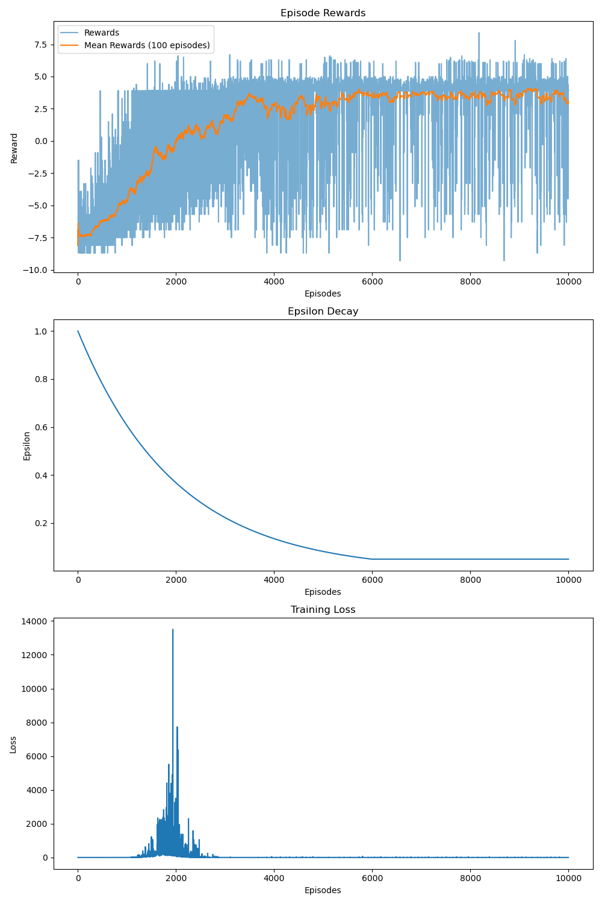
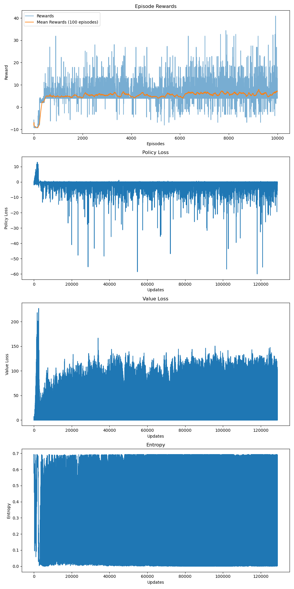
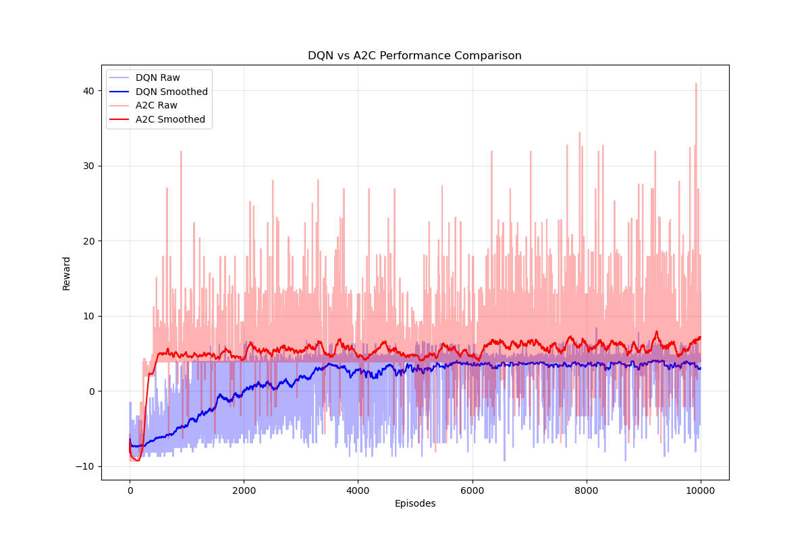

# Deep Reinforcement Learning for Flappy Bird: DQN vs. A2C

This project implements and compares two prominent Deep Reinforcement Learning (DRL) algorithms, Deep Q-Network (DQN) and Advantage Actor-Critic (A2C), applied to the FlappyBird-v0 Gymnasium environment. The aim is to analyze their learning efficiency, performance, and training dynamics for this classic control task.

**Team Members:** Muhammad Maaz Hamid (2022655) & Wardah Haya (2022____)
*(Note: Full ID for Wardah Haya was incomplete in the notebook)*

## Project Overview

The core of this project lies in training DRL agents to play Flappy Bird optimally. We investigate:
*   **DQN:** A value-based, off-policy algorithm, enhanced with Double DQN and Dueling DQN to improve stability and performance.
*   **A2C:** An actor-critic, on-policy algorithm that directly learns both a policy (actor) and a value function (critic).

The agents process a vector-based state representation from the environment (lidar disabled) and are trained for 10,000 episodes.

## Experimental Setup

### Environment
*   **Name:** `FlappyBird-v0`
*   **Library:** `flappy_bird_gymnasium`
*   **State Representation:** Vector-based (e.g., bird's position, pipe coordinates), lidar disabled.
*   **Action Space:** Discrete (typically flap or do nothing).

### General Hyperparameters & Setup
*   **Training Duration:** 10,000 episodes for both agents.
*   **Reproducibility:** `RANDOM_SEED = 42` (for PyTorch, NumPy, Python's random module).
*   **Hardware:** `cuda` (if available), otherwise `cpu`.
*   **Frameworks:** PyTorch, Gymnasium, Matplotlib.

### DQN Specifics
*   **Enhancements:** Double DQN & Dueling DQN enabled.
*   **Replay Memory Size:** 100,000
*   **Mini-batch Size:** 32
*   **Epsilon Schedule:**
    *   `epsilon_init`: 1.0
    *   `epsilon_decay`: 0.9995 (multiplicative per step)
    *   `epsilon_min`: 0.05
*   **Target Network Sync Rate:** 10 steps
*   **Learning Rate (Adam Optimizer):** 0.0001
*   **Discount Factor (γ):** 0.99
*   **Network Architecture (Fully Connected Dueling):**
    *   Input -> FC (512, ReLU) -> Shared Hidden Layer
    *   Shared Hidden Layer -> Value Stream (FC(256, ReLU) -> FC(1))
    *   Shared Hidden Layer -> Advantage Stream (FC(256, ReLU) -> FC(num\_actions))
    *   Q-values combined from V and centered A.

### A2C Specifics
*   **Enhancements:** Entropy regularization.
*   **Learning Rate (Adam Optimizer):** 0.0003 (for the combined actor-critic network)
*   **Discount Factor (γ):** 0.99
*   **Entropy Coefficient (β):** 0.01
*   **Value Loss Coefficient (c\_V):** 0.5
*   **Max Gradient Norm:** 0.5
*   **N-Step Returns (`num_steps`):** 5
*   **Network Architecture (Shared Feature Extractor, Separate Heads):**
    *   Input -> FC (512, ReLU) -> Shared Features
    *   Shared Features -> Actor Head (FC(256, ReLU) -> FC(num\_actions, Softmax))
    *   Shared Features -> Critic Head (FC(256, ReLU) -> FC(1))

## Results & Performance Analysis

Quantitative analysis reveals that A2C significantly outperformed DQN in this environment.

| Metric                                  | DQN              | A2C              |
| :-------------------------------------- | :--------------- | :--------------- |
| Mean Reward (Last 100 Eps)            | 3.07             | 7.21             |
| Max Reward (Training)                   | 8.40             | 40.90            |
| Mean Reward (Overall Training)          | 1.59             | 5.13             |
| Approx. Episodes for Mean Reward Plateau | 7000-8000        | 2000-3000        |

### Training Dynamics
*   **DQN Learning Curve:** Showed slow, gradual improvement with high initial variance. Reached its reward plateau later than A2C.
    
    *Fig. 1: DQN agent training dynamics showing Episode Rewards, Epsilon Decay, and Training Loss.*

*   **A2C Learning Curve:** Exhibited much faster initial learning and a higher reward plateau. Entropy regularization aided exploration. Policy and Value losses showed stable convergence.
    
    *Fig. 2: A2C agent training dynamics showing Episode Rewards, Policy Loss, Value Loss, and Entropy.*

### Comparative Performance
*   A2C learned significantly faster and achieved a higher converged mean reward.
*   Qualitatively, A2C agents appeared to develop smoother, more strategic flapping patterns.
    
    *Fig. 3: Comparison of smoothed episode rewards for DQN vs. A2C.*

The superior performance of A2C is likely due to its on-policy nature, effective advantage estimation with $n$-step returns, and entropy-based exploration leading to more efficient policy improvement in this environment.

## How to Run

1.  **Clone the repository:**
    ```bash
    git clone <repository_url>
    cd <repository_directory>
    ```
2.  **Set up the environment:**
    It's recommended to use a virtual environment (e.g., conda or venv).
    Install necessary dependencies:
    ```bash
    pip install torch torchvision torchaudio --index-url https://download.pytorch.org/whl/cu118  # Or your specific CUDA version / CPU
    pip install gymnasium flappy-bird-gymnasium matplotlib ipython PyYAML
    ```
3.  **Run the Jupyter Notebook:**
    The main experimentation code is within `DRL_project.ipynb`.
    ```bash
    jupyter notebook DRL_project.ipynb
    ```
    Execute the cells in the notebook to train the agents and generate the comparison plots. Training logs, saved models (`.pt`), and individual training graphs (`.png`) will be saved in the `runs/` directory.

## Discussion & Conclusion

In the context of the \texttt{FlappyBird-v0} environment using a vector-based state representation, A2C demonstrated superior performance over DQN (with Double and Dueling enhancements) in terms of learning speed, final reward, and policy stability. The on-policy, actor-critic approach with $n$-step returns and entropy regularization proved more effective for this specific task and setup.

## Future Work
*   Test on a broader suite of environments.
*   Adapt agents for pixel-based inputs using CNNs.
*   Compare against more advanced algorithms (e.g., PPO, SAC).
*   Conduct systematic hyperparameter optimization.
*   Incorporate detailed behavioral metrics for analysis.